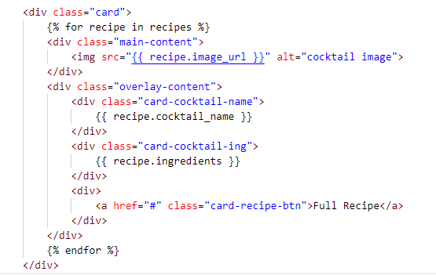
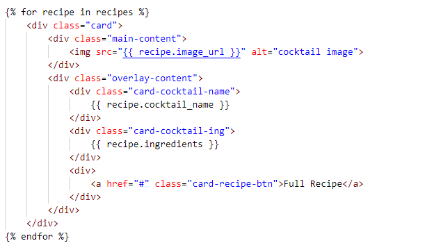
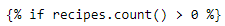
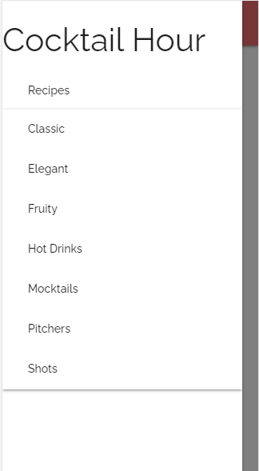
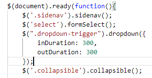
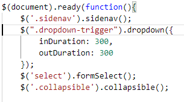
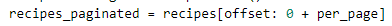
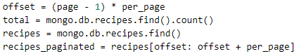

# Full Testing
## Contents
+ [Testing From User Stories](#testing-from-user-stories)
+ [Manually Testing Functionality](#manually-testing-functionality)
+ [Responsive Testing](#responsive-testing)
+ [Bugs and Fixes](#bugs-and-fixes)
+ [Known Bugs](#known-bugs)
---
---
## Testing From User Stories

---
---
## Manually Testing Functionality

---
---
## Responsive Testing

---
---
## Bugs and Fixes
### 1. Card Overlaying

When initially putting together the card layout, I was having an isse where the reicpe card was layering on top of the previous one rather than generating it's own card

After a bit of experimenting, I moved the entire card div into the for loop and managed to sort this issue. 

---
### 2. TypeError - len vs count()

---

### 3. Side Nav Dropdown

---
### 4. 

---
### 5. Deleting from Modal

 

---
### 6. Selecting option on mobile

  
  

---

## Pagination

