# Full Testing
## Contents
+ [Validator Testing](#validator-testing)
+ [Lighthouse Testing](#lighthouse-testing)
+ [PowerMapper Compatibility](#powermapper-compatibility)
+ [Testing From User Stories](#testing-from-user-stories)
+ [Manually Testing Functionality](#manually-testing-functionality)
+ [Responsive Testing](#responsive-testing)
+ [Bugs and Fixes](#bugs-and-fixes)
+ [Known Bugs](#known-bugs)
---
---
## Validator Testing

---
---
## Lighthouse Testing

### **Performance**

convrt all images to webp format

### **Accesibility**

Footer h4 changed to h1
Add alt tags to all images
Add title to all links
Place side nav header into li

### **Best Practices**
Add ```rel="nopener"``` to all external links

### **SEO**
Add meta description

---
---
## PowerMapper Compatibility

---
---
## Testing From User Stories

---
---
## Manually Testing Functionality

---
---
## Responsive Testing

---
---
## Bugs and Fixes

### **Carousel Text**


---
### **Card Overlaying**


When initially putting together the card layout, I was having an isse where the reicpe card was layering on top of the previous one rather than generating it's own card


After a bit of experimenting, I moved the entire card div into the for loop and managed to sort this issue. 

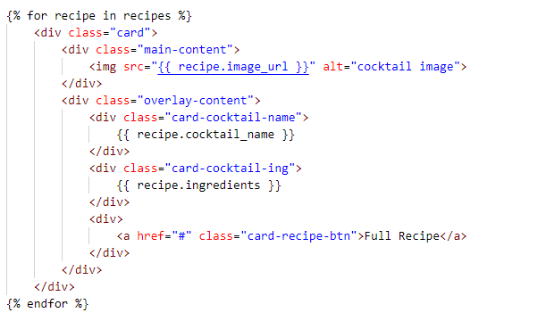

---
### **TypeError - length vs count()**

I followed the CI task manager project for the initial stages of this project. Most things translated well except the ```length``` property. When called, it would cause a TypeError.

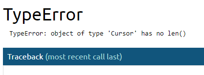

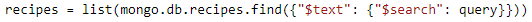

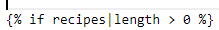

I did a lot of research on this and while there were a few different fixes, the one that worked best for this project was to change the ```recipes``` variable from a list and use the ```count()``` fuction instead.

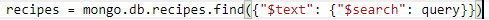


---

### **Side Nav Dropdown**

When using the Materialize navigaiton bar dropdown, the side nav dropdown on mobile was covering the content below, rather than pushing the content down. 

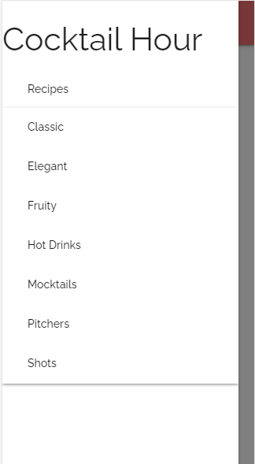

I believe this is expected behaviour but from a UX standpoint, I wasn't happy with this on mobile.
As a result, I decided that it would be a better idea to use a Materialize collapsible on the side-nav instead. This allows the sub-menu to reposition all of the other elements rathen than them being covered. 

---
### **Hover on Mobile**

I added ```hover:true``` to the dropdown menu which worked fine on desktop. But with mobile, it was causing a massive glitch - when you would click the dropdown menu, it would appear for a split second and disappear. 

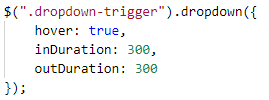

I tried removing the ```inDuration``` and ```outDuration``` but it was still happening. I decided to remove the ```hover``` option altogether and this fixed the issue. 

---
### **Deleting from Modal**

For defensive programming, I added a modla to the delete button for user confirmation. However, regardless of which recipe was selected to delete, it was always the first recipe on screen that would be deleted. 

After talking to someone on slack who had experienced the same issue, I was informed that there needed to be a direct link between the modal and the element to be deleted. 

I updated the recipe-side modal href and the actual modal ID to target the specific recipe card to be deleted. 

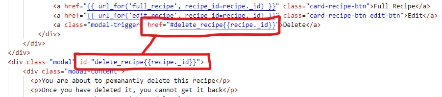 

---
### **Selecting option on mobile**

On mobile, the 'Choose Collection' option in both add and edit recipe wasn't working as it should. There was an issue with selecting the options - you would select 'Fruity', but 'Mocktails' would highlight, as if there had been an upwas shift in the selection area. 

 

Oringially the ```formSelect()```m function was placed above the ```dropdown()``` function, both of which were triggered by the 'Choose Collection' dropdown. I know that the order of code matters so I tried to reorder them.

  

This fixed the issue.

---

### **Pagination in Catagories Pages**

When visitn a specific collection of recipes, the correct recipes for that category were displating. Hoever, the pagination information was displaying the total number of recipes in the database. 

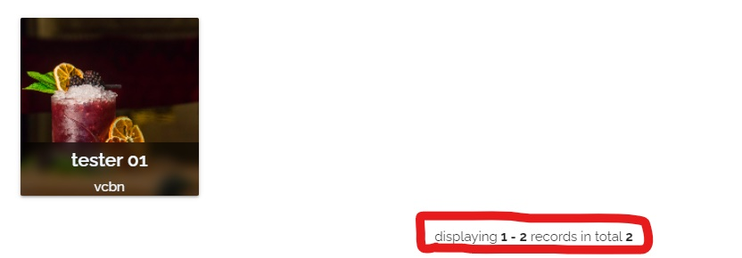

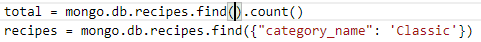

Becuse I hadn't specified the ```category_name``` in the ```find()``` function for the ```total``` variable, it was counting all recipes and then displaying this number as the total. 


Adding the ```category_name``` key and the correct value in the ```total``` variable fixed the issue.

---

### **Input Field Dynamic ID**

When dynamically adding a new input field for ingredients and method, there was an issues with clicking the input field. When the second input was clicked, the focus would jump back up to the original input. 

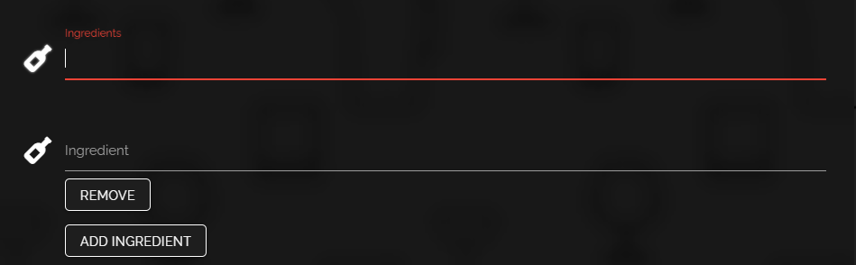

This was because I had not been dynamically adding a new ID to the newly created input fields. Adding an incrementing variable to the ID fixed this issue. 

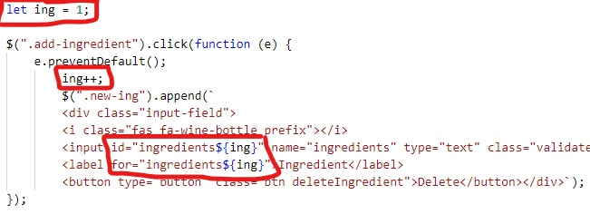

---

### **Unbalanced Tuple Unpacking**

A pylint warning appeared when I added the pagination functionality:


This was a non-issue as everything was working as it should, and the code worked fine.

After a bit of research I learned that this is refered to as a 'false positive' and by adding the below comment, the warning would go away: 

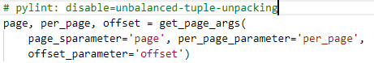

---

### **Scroll-To-Top TypeError**

I added a button to redirect the user back to the top of the page when they had scrolled for a certain amount of pixels. But because the button isn't present on all pages, the JS script was looking for it, not finding it and then throwing the error:

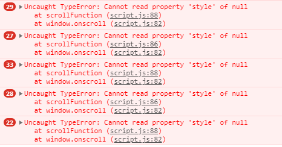

Wrapping the whole button functionality inside an if statement allowed the script to check if the button was on that page and either run the functions if it was, and ignore them if it wasn't.

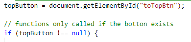

---

### **Heading Text Mobile Display**
 On mobile display, a particularly long or multiple word heading 


Making the font responsive to the view width allowed for longer text to diplay properly without overflowing off the screen. I used a medie query targeted specifically at smaller screens so the desktop display didn't look oversized. 

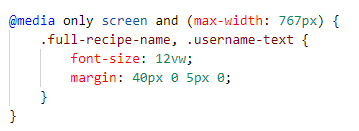


---

### **Dynamic Input Pattern Attribute**

When I added the ```pattern=".*\S+.*"``` attribute to the dynamically created input fields, they weren't rendering through to HTML correctly. It was rendering as ```pattern=".*S+.*"```, ommiting the backslash. 

To counter this, I added an extra backslash: ```pattern=".*\\S+.*"``` and this solved the issue. 

---
---
## Known Bugs

### **URL & Username bug**

When testing error pages, I was adding addition characters to the end of the URL in the acccount page, anything that was changed/edited was updating the username header on the page:


I defined username as a variable in the acocunt section of the app.py file:

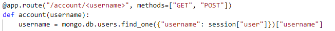

I retested and, while it solved that issue, adding the extra charcters didn't break the code. This is an issue that hasn't been resolved. 

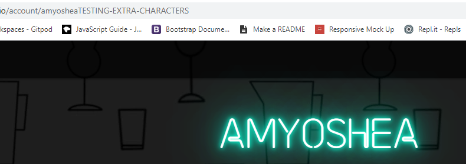